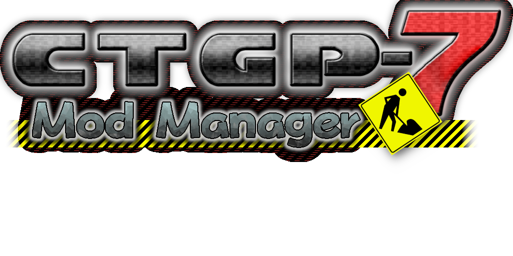

**CTGP-7 Mod Manager** is a Nintendo 3DS homebrew application that allows users to easily install, update, and uninstall mods from [GameBanana](https://gamebanana.com/games/5955) for CTGP-7.


## Building from Source

### Prerequisites

To compile this program, you will need to install **devkitPro**. Please follow the [devkitPro Getting Started Guide](https://devkitpro.org/wiki/Getting_Started) to set up your environment.

You will also need to install the required 3DS portlibs (`3ds-curl`, `3ds-libjson-c`, and `3ds-libvorbisidec`). You can install these and their dependencies using devkitPro's package manager:

```bash
dkp-pacman -S 3ds-curl 3ds-libjson-c 3ds-libvorbisidec 3ds-libjpeg-turbo 3ds-libarchive
```

_(Note: If you are using MSYS2 on Windows, simply use `pacman` instead of `dkp-pacman`.)_

### Compilation

Once all dependencies are installed, open your terminal, navigate to the project directory, and compile the application by running:

```
make
```

## Credits:

* NitroShell – Original Idea, Project Lead, Programming Music Assistance
* bonkmaykr – CTGP-7 Mod Manager Logo, Music, Programming
* MisakiP_ - Programming. Playtesting
* Straky - Home Menu Icon, Playtesting
* gameonion – CTGP-7 Logo

## Libraries & Tools

* https://github.com/devkitpro
* https://github.com/krrgit/imgui-3ds
